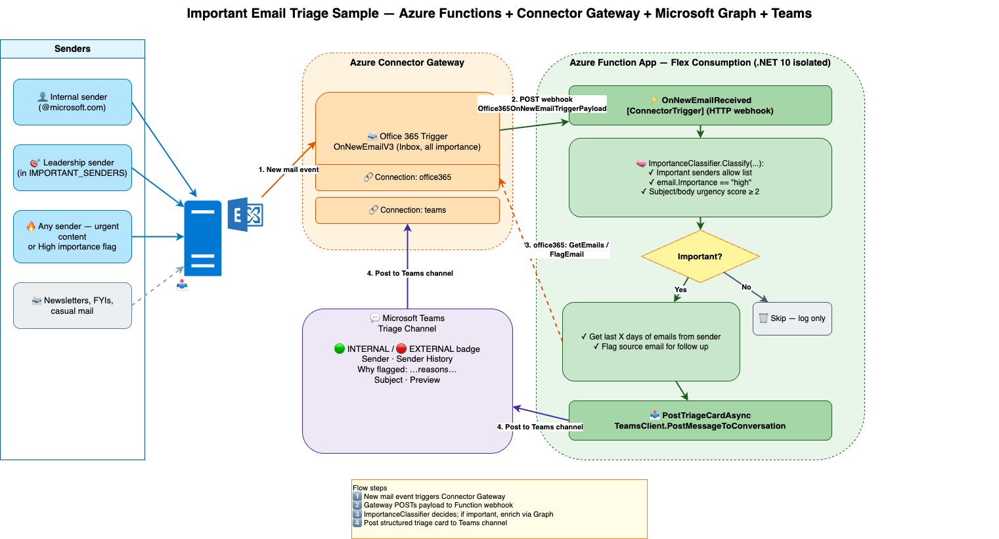

# Azure Functions Connectors Sample

This sample demonstrates how to use **Azure Functions** with **Connector Gateway connectors** to react to events from external services. It listens for new emails arriving in an Office 365 inbox, classifies each one with a small in-process importance heuristic, and — for the ones that pass the bar — enriches the message with **sender history** from the same mailbox, posts a formatted card to a **Microsoft Teams** channel, and **flags the source email** in Outlook so the recipient also has a server-side follow-up reminder.

## Architecture



> Editable source: [docs/architecture.drawio](docs/architecture.drawio) (open with [draw.io](https://app.diagrams.net)).

- **Azure Functions (Flex Consumption)** — A .NET 10 isolated worker function app that receives HTTP callbacks from the Connector Gateway.
- **Connector Gateway** — Manages two connections (Office 365, Teams) and the Office 365 trigger configuration.
- **Office 365 Outlook Connector** — Used in two ways:
  - As a **trigger** — the gateway watches the Inbox (`folderPath: Inbox`) and calls the function for every new email.
  - As a **client** inside the function — `GetEmailsAsync` to fetch sender history (last N messages from the same sender), and `FlagAsync` to set the Outlook follow-up flag on the source email when it's classified as important. Scales to any tenant size because everything is scoped to the watched mailbox — no directory enumeration required.
- **Teams Connector** — Posts the enriched triage card to a configured Teams channel.

## Prerequisites

- [Azure Developer CLI (azd)](https://learn.microsoft.com/azure/developer/azure-developer-cli/install-azd)
- [Azure CLI](https://learn.microsoft.com/cli/azure/install-azure-cli)
- [.NET 10 SDK](https://dotnet.microsoft.com/download/dotnet/10.0)
- [Azure Functions Core Tools v4](https://learn.microsoft.com/azure/azure-functions/functions-run-local)
- [jq](https://jqlang.github.io/jq/) (required by the post-deploy script on Linux/macOS)
- An Azure subscription
- An Office 365 account (for the email connector)

## Getting Started

### 1. Clone Required Repositories

This project references two companion libraries via local project references (NuGet packages are not yet available). Clone all three repositories into the **same parent directory**:

```bash
git clone <url>/FunctionAppConnectorsEmailProcessor
git clone <url>/azure-functions-connector-extension
git clone <url>/azure-logicapps-connector-sdk
```

Your folder structure should look like:

```
connectors/
├── FunctionAppConnectorsEmailProcessor/
├── azure-functions-connector-extension/
└── azure-logicapps-connector-sdk/
```

### 2. Deploy to Azure

```bash
cd FunctionAppConnectorsEmailProcessor
azd up
```

This provisions all infrastructure (Function App, Connector Gateway, Storage, Application Insights) and deploys the function code. After deployment, a post-deploy script automatically creates the Connector Gateway trigger configuration.

### 3. Authorize the Connections

> **⚠️ Important:** After deployment, you **must** authorize both connector connections in the Azure portal before the end-to-end flow will work. Each connection is created in a disabled state and requires OAuth consent.

1. Open the [Azure Portal](https://portal.azure.com).
2. Navigate to the **Resource Group** created by the deployment.
3. Open the **Connector Gateway** resource.
4. Go to **Connections** and authorize each of the two connections in turn:
   - **Office 365** — sign in with the account whose inbox you want to monitor (drives the trigger, sender-history lookup, and follow-up flag).
   - **Teams** — sign in with an account that can post to the target Teams channel.

Until both connections are authorized, the trigger will not fire and/or notifications will fail.

### 4. Test the Solution

Once the connections are authorized, send an email to the authorized account. The function classifies it via [function-app/ImportanceClassifier.cs](function-app/ImportanceClassifier.cs); for important ones it (1) calls the Office 365 connector to get the sender's recent history across the Inbox and Archive folders, (2) posts an enriched triage card to the configured Teams channel, and (3) flags the source email in Outlook.

You can also manually test the function endpoint using the [test.http](test.http) file (update the URL and function key to match your deployment).

## Project Structure

| Path | Description |
|---|---|
| `function-app/` | Azure Functions application (.NET 10, isolated worker) |
| `function-app/ProcessEmail.cs` | Function triggered for every new email; classifies importance, looks up sender history via the Office 365 connector, posts to Teams, and flags the source email |
| `function-app/Program.cs` | Host builder, registers Teams and Office 365 connector clients |
| `infra/main.bicep` | Main Bicep template for all Azure resources |
| `infra/connectorGateway.bicep` | Connector Gateway plus Office 365 and Teams connection resources |
| `infra/scripts/postdeploy.sh` | Post-deploy script (Linux/macOS) — creates the Office 365 trigger config |
| `infra/scripts/postdeploy.ps1` | Post-deploy script (Windows) — creates the Office 365 trigger config |
| `azure.yaml` | Azure Developer CLI project configuration |
| `test.http` | Sample HTTP request for manual testing |

## Resources

- [Azure Functions documentation](https://learn.microsoft.com/azure/azure-functions/)
- [Azure Functions Flex Consumption plan](https://learn.microsoft.com/azure/azure-functions/flex-consumption-plan)
- [Azure Developer CLI (azd)](https://learn.microsoft.com/azure/developer/azure-developer-cli/)
